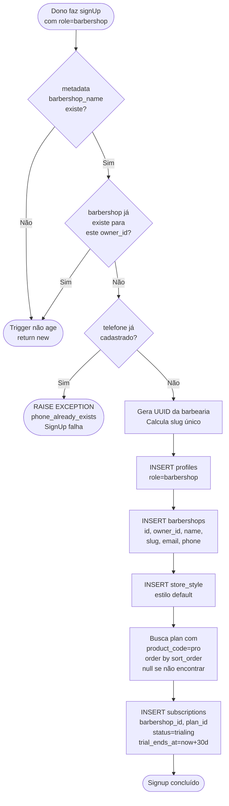
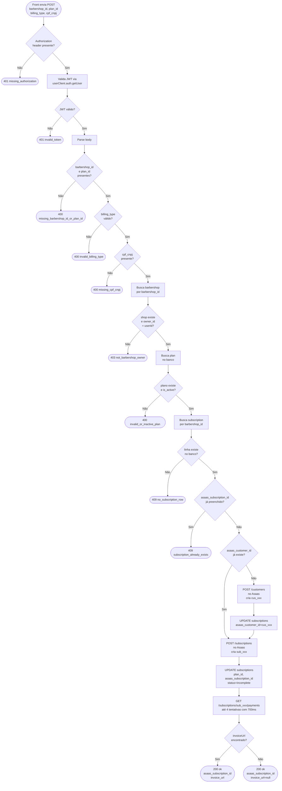
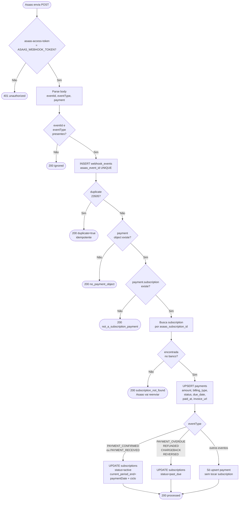
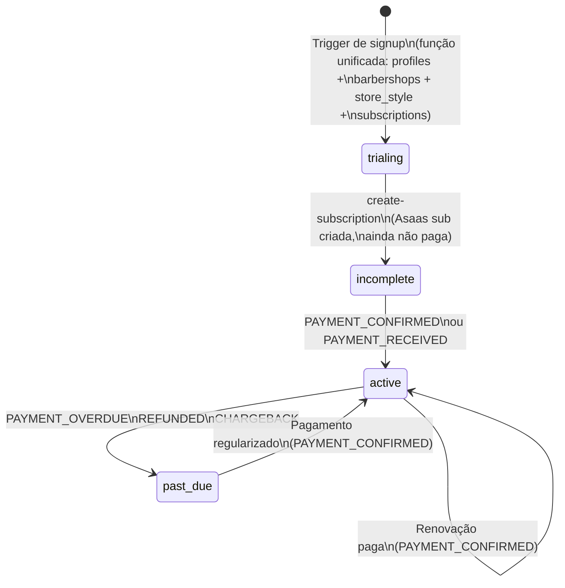

# Fluxo de Billing — Virtual Barber + Asaas

## Visão geral

O billing é composto por três partes independentes que se encadeiam:

| Parte                     | Onde roda           | O que faz                                             |
| ------------------------- | ------------------- | ----------------------------------------------------- |
| **Trigger de signup**     | Postgres (Supabase) | Cria barbearia + linha `trialing` em `subscriptions`  |
| **`create-subscription`** | Edge Function       | Converte o trial em assinatura paga no Asaas          |
| **`asaas-webhook`**       | Edge Function       | Escuta confirmações do Asaas e libera/bloqueia acesso |

---

## 1. Signup — trigger cria o trial

> **Estado resultante:** `subscriptions.status = trialing`, `plan_id` preenchido com o plano `pro` de menor `sort_order` (ou `null` se nenhum plano ativo existir), sem nenhum ID do Asaas.

---

## 2. create-subscription — conversão trial → pago

Chamada pelo dono logado no manager quando escolhe o plano e clica em assinar.

> **Estado resultante:** `subscriptions.status = incomplete`, `asaas_subscription_id` preenchido.  
> Acesso **NÃO** liberado aqui. Quem libera é o webhook.

---

## 3. asaas-webhook — confirma pagamento e controla acesso

> **Estado resultante após pagamento confirmado:** `subscriptions.status = active`, `current_period_end` calculado.

---

## 4. Máquina de estados de `subscriptions.status`

---

## 5. Vulnerabilidades e melhorias identificadas

### 🔴 Crítico

| #   | Onde                                   | Problema                                                                                                             | Correção                                                                                |
| --- | -------------------------------------- | -------------------------------------------------------------------------------------------------------------------- | --------------------------------------------------------------------------------------- |
| 1   | `create-subscription` response headers | CORS hardcoded `http://localhost:5173` — vai quebrar em produção                                                     | Usar env var `ALLOWED_ORIGIN` ou `*` controlado                                         |
| 2   | ~~Trigger de signup~~                  | ~~Se não existir nenhum plano `pro` ativo no banco, o signup inteiro falha com exception — bloqueia novos clientes~~ | ✅ **Resolvido** — `plan_id` agora é nullable; signup nunca falha por ausência de plano |

### 🟠 Segurança

| #   | Onde                  | Problema                                                                                                 | Correção                                                                                                  |
| --- | --------------------- | -------------------------------------------------------------------------------------------------------- | --------------------------------------------------------------------------------------------------------- |
| 3   | `asaas-webhook`       | Só valida o token no header, sem IP allowlist                                                            | Adicionar verificação do IP de origem do Asaas (range publicado na doc deles) como defesa em profundidade |
| 4   | `create-subscription` | `cpf_cnpj` é aceito sem nenhuma validação de formato/tamanho — erro chega só no Asaas                    | Validar 11 dígitos (CPF) ou 14 (CNPJ) antes de chamar o Asaas                                             |
| 5   | `create-subscription` | Sem rate limiting — mesmo usuário pode criar N customers no Asaas se apagar `asaas_customer_id` no banco | Adicionar rate limit por `userId` na edge function                                                        |

### 🟡 Integridade de dados

| #   | Onde                  | Problema                                                                                                                                                                                  | Correção                                                                                                                                     |
| --- | --------------------- | ----------------------------------------------------------------------------------------------------------------------------------------------------------------------------------------- | -------------------------------------------------------------------------------------------------------------------------------------------- |
| 6   | `create-subscription` | Se a função criar o customer no Asaas mas crashar antes do `UPDATE asaas_customer_id`, o próximo retry cria um segundo customer (`cus_xxx` diferente) — os dois ficam pendurados no Asaas | Salvar `asaas_customer_id` antes de criar a subscription, com retry-safe (já quase feito, mas o crash entre criar e salvar ainda é possível) |
| 7   | `create-subscription` | `nextDueDate: dueDateInDays(0)` — 1ª cobrança é **hoje**, sem carência                                                                                                                    | Usar `dueDateInDays(1)` ou conforme política comercial                                                                                       |
| 8   | `asaas-webhook`       | `subscription_not_found` responde 200 e não agenda retry — se o webhook chegar antes do `create-subscription` persistir o ID no banco, o evento é perdido                                 | Responder 500 nesse caso específico para o Asaas reenviar, ou usar uma fila de reprocessamento                                               |

### 🟢 Melhorias pontuais

| #   | Onde                  | Sugestão                                                                                                                                                                                              |
| --- | --------------------- | ----------------------------------------------------------------------------------------------------------------------------------------------------------------------------------------------------- | -------------------------------------------- |
| 9   | `create-subscription` | Passar `email` do shop para `createCustomer` — melhora rastreamento no painel do Asaas                                                                                                                |
| 10  | `create-subscription` | O loop de 4× buscando `invoiceUrl` pode atrasar a resposta em até ~2s — retornar `invoice_url: null` na 1ª tentativa e deixar o webhook `PAYMENT_CREATED` entregar a URL é mais robusto               |
| 11  | `asaas-webhook`       | O campo `error` da tabela `webhook_events` está sendo usado tanto para erros reais quanto para notas (`note: subscription_not_found_yet`) — criar coluna `note` separada evita confusão em dashboards |
| 12  | Trigger signup        | `product_code = 'pro'` está hardcoded no trigger — se o código do produto mudar no banco, o trial cria subscription com `plan_id = null` silenciosamente                                              | Usar uma constante ou tabela de configuração |
