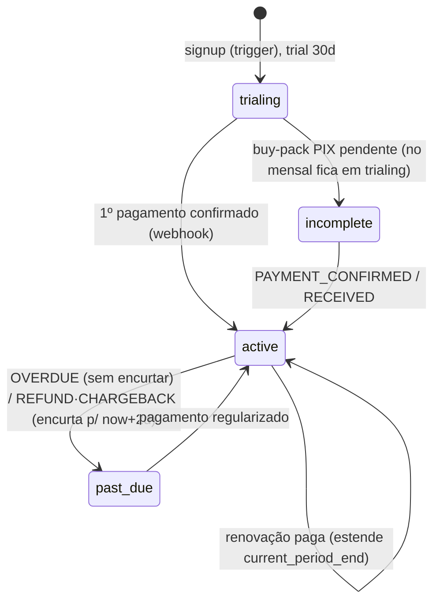

# Fluxo de Pagamento — Virtual Barber (Asaas)

> Documento técnico do estado **atual** do fluxo de pagamento (pós-correções de
> jun/2026). É a **fonte de verdade**; o antigo `docs/FLUXO-ASAAS.md` está
> desatualizado (descreve uma `create-subscription` única que não existe mais).

## Sumário
1. [Princípio central](#1-princípio-central)
2. [Componentes](#2-componentes)
3. [Estados da assinatura](#3-estados-da-assinatura)
4. [Tabelas](#4-tabelas)
5. [Fluxo passo a passo — quando cada função roda](#5-fluxo-passo-a-passo--quando-cada-função-roda)
6. [Mensal vs. Pacote](#6-mensal-vs-pacote)
7. [Webhook em detalhe](#7-webhook-em-detalhe-eventos--efeito)
8. [Idempotência e anti contagem-dupla](#8-idempotência-e-anti-contagem-dupla)
9. [Cupons](#9-cupons)
10. [Concorrência (lock de provisionamento)](#10-concorrência-lock-de-provisionamento)
11. [Acesso / gating](#11-acesso--gating)
12. [Operação (crons, alertas, segredos)](#12-operação-crons-alertas-segredos)
13. [Correções aplicadas](#13-correções-aplicadas-jun2026)
14. [Testes](#14-testes)
15. [Limitações conhecidas](#15-limitações-conhecidas)

---

## 1. Princípio central

> **`subscriptions.current_period_end` é a única verdade do acesso, e só o
> `service_role` (edge functions) escreve nele.** O gate de acesso
> (`is_barbershop_active`) só olha a data — não importa se foi PIX, cartão
> recorrente ou pacote que estendeu o período.

Duas garantias sustentam o fluxo:
- **Idempotência:** reprocessar o mesmo pagamento nunca soma ciclo duas vezes
  (âncora estável no `dueDate` + `max(atual, candidato)`).
- **Escrita controlada:** clientes só têm `SELECT` em `subscriptions`/`payments`
  via RLS; toda escrita passa por edge function com `service_role`.

---

## 2. Componentes

| Componente | Onde roda | Papel |
| --- | --- | --- |
| `handle_new_barbershop_user` | Postgres (trigger em `auth.users`) | No signup: cria profile + barbershop + store_style + `subscriptions` trial |
| `create-monthly-subscription` | Edge Function (JWT) | Converte trial em **assinatura mensal recorrente** no Asaas |
| `buy-pack` | Edge Function (JWT) | Compra **pacote** semestral/anual como **cobrança única** |
| `asaas-webhook` | Edge Function (token) | Recebe eventos do Asaas → ativa/renova/revoga acesso |
| `reconcile-subscriptions` | Edge Function (segredo, via cron) | Rede de segurança: reprocessa eventos presos em `webhook_events` |
| `_shared/asaas.ts` | Lib comum | HTTP Asaas, validações, `computeNewPeriodEnd`, `applyCouponDiscount`, etc. |
| `is_barbershop_active` | Função SQL | Gate de acesso (período + carência ou trial) |

Arquivos: [`supabase/functions/`](../supabase/functions) · esquema de referência em
[`supabase/schema.sql`](../supabase/schema.sql).

---

## 3. Estados da assinatura

Enum `subscription_status`: `trialing` · `incomplete` · `active` · `past_due` · `canceled`.

| Status | Significado | `current_period_end` |
| --- | --- | --- |
| `trialing` | Período de teste de 30 dias (criado no signup) | `null` (usa `trial_ends_at`) |
| `incomplete` | Pacote (`buy-pack`) com pagamento pendente — típico PIX. No mensal, o PIX pendente permanece em `trialing` até confirmar. | inalterado |
| `active` | Pago e válido | data futura |
| `past_due` | Falha/atraso/estorno | mantido (overdue) ou encurtado p/ now+2d (estorno) |
| `canceled` | Cancelada | — |

---

## 4. Tabelas

| Tabela | Papel |
| --- | --- |
| `plans` | Catálogo (preço, `asaas_cycle`, `product_code`). Preço **nunca** vem do request. |
| `subscriptions` | Estado por barbearia (1:1). Campo-verdade: `current_period_end`. |
| `payments` | Histórico de cobranças (espelho do Asaas, idempotente por `asaas_payment_id`). |
| `webhook_events` | Log de todo evento recebido; base do dedup e do reconcile. |
| `coupons` | Cupons de desconto (`uses_count`/`max_uses`). |
| `asaas_rate_limits` | Rate limit por chave (`create-sub:<uid>`, `buy-pack:<uid>`). |
| `ops_alerts` | Alertas operacionais (falha de pagamento, gave_up, erro de reconcile). |

---

## 5. Fluxo passo a passo — quando cada função roda

### Fase 0 — Signup (uma vez)
1. Front chama `supabase.auth.signUp` com `role='barbershop'` + metadata.
2. O INSERT em `auth.users` dispara **`handle_new_barbershop_user`**, que na mesma
   transação valida telefone, gera slug único e cria `profiles`, `barbershops`,
   `store_style` e `subscriptions` (`status='trialing'`, `trial_ends_at=now()+30d`,
   `current_period_end=null`).
3. Durante o trial o acesso é liberado por **`is_barbershop_active`** (ramo trial).

### Fase 1 — Checkout (dono logado no manager, JWT)
4. A página chama **`getMySubscription`**; o front decide se mostra checkout.
5. (Opcional) valida cupom via RPC **`validate_coupon`**.
6. Conforme o ciclo do plano, o front chama **uma** edge function:
   - Plano **MONTHLY** → **`create-monthly-subscription`**.
   - Plano **SEMIANNUALLY/YEARLY** → **`buy-pack`**.

### Fase 2 — Dentro da edge function (ordem de execução)
7. `getUser()` (valida JWT) → valida body → `isValidCpfCnpj`.
8. **`asaas_rate_limit_hit`** (8/min por usuário).
9. Carrega `barbershops` (confere `owner_id`), `addresses`, `plans` (confere
   `is_active` e ciclo correto) e, se houver, o cupom.
10. Regra dos 7 dias: bloqueia renovação antecipada do **mesmo** plano ativo
    (`subscription_already_active`). Exceção: mensalista trocando para pacote
    é sempre permitido.
11. **`claim_subscription_provisioning`** — lock anti-concorrência (2 min).
12. Cancela a assinatura Asaas anterior, se existir (troca de plano / re-assinatura).
13. Cria/reusa o **customer** no Asaas.
14. Calcula preço final com **`applyCouponDiscount`**; se houver cupom,
    **reserva** com **`increment_coupon_usage`** (atômico) **antes** de cobrar.
15. Cria a cobrança no Asaas:
    - mensal → `createSubscription` (recorrente);
    - pacote → `createOneTimePayment` (avulso, parcelável no cartão).
16. Persiste em `payments`, grava `plan_id`/IDs Asaas e **libera o lock**.
17. Se já nasce confirmado (cartão), ativa na hora (`status='active'`,
    `current_period_end` via `computeNewPeriodEnd`). Se PIX, devolve o **QR Code**
    e fica pendente (`incomplete`). Em falha pós-reserva, **`decrement_coupon_usage`**.

### Fase 3 — Confirmação assíncrona (webhook)
18. Asaas chama **`asaas-webhook`** (auth por header `asaas-access-token`,
    comparação em tempo constante).
19. Dedup por `processed_at` + registro em `webhook_events`.
20. Localiza a `subscriptions` (por `asaas_subscription_id`; senão por
    `externalReference` = `barbershop_id`, com backfill p/ recorrentes).
21. Upsert idempotente em `payments` e aplica o efeito (ver §7).
22. Erros transitórios viram retry (HTTP 500) até `MAX_ATTEMPTS=5`; depois `gave_up`.

### Fase 4 — Rede de segurança (cron)
23. **`reconcile-subscriptions`** (chamada por cron com `x-reconcile-secret`) relê
    eventos presos (`processed_at` nulo ou `gave_up`, com >5 min) e reaplica o
    efeito a partir do payload salvo — com a **mesma** lógica do webhook.

### Acesso (o tempo todo)
24. **`is_barbershop_active`** decide o acesso, inclusive no RLS `gate_inserts` de
    `barbershop_members`.

---

## 6. Mensal vs. Pacote

| | Mensal (`create-monthly-subscription`) | Pacote (`buy-pack`) |
| --- | --- | --- |
| Asaas | `POST /subscriptions` (recorrente) | `POST /payments` (avulso) |
| `asaas_subscription_id` | preenchido | `null` |
| Renovação | automática (Asaas cobra todo ciclo) | manual (recompra) |
| Ciclos | MONTHLY | SEMIANNUALLY, YEARLY |
| Parcelamento | — | cartão, `installmentCount` |
| Localização no webhook | por `asaas_subscription_id` | por `externalReference` |

---

## 7. Webhook em detalhe (eventos → efeito)

| Grupo | Eventos | Efeito |
| --- | --- | --- |
| **Confirmação** | `PAYMENT_CONFIRMED`, `PAYMENT_RECEIVED` | `status='active'`; `current_period_end = max(atual, dueDate + ciclo)` |
| **Estorno** | `PAYMENT_REFUNDED`, `PAYMENT_CHARGEBACK_REQUESTED`, `PAYMENT_REVERSED` | `status='past_due'` **+** encurta `current_period_end` p/ `now+2d` (nunca estende) + `ops_alerts` |
| **Atraso** | `PAYMENT_OVERDUE` | `status='past_due'` (sem mexer no período) + `ops_alerts` |

Detalhes:
- **Pacote sem `asaas_subscription_id`** é processado via `externalReference`
  apenas em eventos de **confirmação** ou **estorno** (atraso/“sem assinatura”
  são ignorados como terminais).
- **Parcelas 2+** de pacote (`installmentNumber > 1`) **não** estendem o período
  (já concedido na 1ª parcela/compra).

---

## 8. Idempotência e anti contagem-dupla

> Contexto: houve um bug em que uma assinatura renovava por **2×** o tempo comprado.

A correção combina três peças:
1. **Âncora estável no `dueDate`** (nunca `now()`): reprocessar o mesmo pagamento
   gera sempre o **mesmo** `candidate = dueDate + ciclo`.
2. **`current_period_end = max(atual, candidate)`**: nunca soma ciclo em cima de
   ciclo, nunca encurta.
3. Nas edge functions, **`computeNewPeriodEnd`** ancora no `current_period_end`
   atual (se futuro) para **preservar dias restantes** na renovação.

Resultado: edge function ativar na hora **e** o webhook chegar depois para o
mesmo pagamento → o `max()` mantém o valor já gravado em vez de somar de novo.

**Renovação via PIX (preservação de dias):** quando o pagamento confirma depois
(PIX), a edge function grava em `pending_period_end` o fim calculado preservando
os dias restantes (`computeNewPeriodEnd`). O webhook, ao confirmar, usa
`max(current, pending, candidate(dueDate))` e zera o `pending`. Assim a renovação
antecipada via PIX não perde os dias, e continua idempotente (pending velho é
ignorado pelo `max`). `pending_period_end` **não** libera acesso — só
`current_period_end`.

---

## 9. Cupons

- **`validate_coupon(code)`** — validação read-only para a UI (só `authenticated`).
- **`increment_coupon_usage(id)`** — consome 1 uso de forma **atômica** com guarda
  `max_uses`/`expires`/`is_active`; retorna `false` se não pôde consumir. Chamado
  **antes** da cobrança (reserva).
- **`decrement_coupon_usage(id)`** — libera a reserva se a cobrança falhar.
- Privilégios: as duas RPCs de uso são **exclusivas do `service_role`**
  (revogadas de `anon`/`authenticated`/`PUBLIC`).

`applyCouponDiscount`: `percentage` (0–100) ou `fixed` (reais), com piso de R$1,00.

---

## 10. Concorrência (lock de provisionamento)

**`claim_subscription_provisioning(id)`** seta `provisioning_started_at = now()`
se o lock está livre (nulo ou > 2 min — request morreu no meio). Não depende mais
de `asaas_subscription_id`, o que permite **troca de plano / re-assinatura a
qualquer momento**. Rate limit adicional por usuário em `asaas_rate_limits`.

---

## 11. Acesso / gating

**`is_barbershop_active(barbershop_id)`** (fonte única) retorna `true` se:
- `status <> 'canceled'` **e** `now() < current_period_end + grace_period_days`
  (default **6** dias); **ou**
- `status='trialing'` e `now() < trial_ends_at`.

`has_active_access` agora é apenas um **alias** que delega a `is_barbershop_active`.

---

## 12. Operação (crons, alertas, segredos)

**Crons (pg_cron):**
- `cleanup-unverified-users` (03:00) — remove usuários não verificados >48h,
  apagando os filhos da barbearia na ordem correta (anti-FK).
- `prune-webhook-events` (03:00) — apaga eventos processados >90d.
- `prune-rate-limits` (03:30) — limpa janelas de rate limit >1d.
- (configurar) chamada periódica do `reconcile-subscriptions`.

**Alertas:** `ops_alerts` recebe `payment_failed`, `payment_revoked`, `gave_up`,
`reconcile_error`.

**Segredos / env:** `ASAAS_API_KEY`, `ASAAS_WEBHOOK_TOKEN`, `RECONCILE_SECRET`,
`ALLOWED_ORIGINS`, `SUPABASE_URL`, `SUPABASE_ANON_KEY`, `SUPABASE_SERVICE_ROLE_KEY`.
O `asaas-webhook` e o `reconcile-subscriptions` rodam com **Verify JWT desligado**
(autenticam por header próprio).

---

## 13. Correções aplicadas (jun/2026)

SQL em [`supabase/critical-fixes.sql`](../supabase/critical-fixes.sql),
[`supabase/medium-light-fixes.sql`](../supabase/medium-light-fixes.sql) e
[`supabase/fix-pix-renewal.sql`](../supabase/fix-pix-renewal.sql).

| # | Sev | Correção |
| --- | --- | --- |
| 1 | 🔴 | `handle_new_barbershop_user` com `SET search_path` (anti hijack) |
| 2 | 🔴 | `claim_subscription_provisioning` sem `asaas_subscription_id IS NULL` → libera troca mensal→pacote |
| 3 | 🔴 | `reconcile-subscriptions` passa a cobrir pagamentos de **pacote** (paridade com o webhook) |
| 4 | 🔴 | Cupom: `increment/decrement_coupon_usage` atômicos (não estoura `max_uses`) |
| 5 | 🟡 | `cleanup_unverified_users` apaga filhos antes da barbearia (anti-FK) |
| 6 | 🟡 | Estorno/chargeback → `past_due` **+ encurta período p/ now+2d** (webhook + reconcile, recorrente **e** pacote) |
| 8 | 🟡 | `has_active_access` passa a delegar a `is_barbershop_active` (fonte única) |
| 9 | 🟡 | Renovação **antecipada via PIX** preserva os dias restantes (coluna `pending_period_end`) |
| 10 | 🟢 | `reconcile` fail-closed se `RECONCILE_SECRET` ausente |
| 11 | 🟢 | `validate_coupon` revogado de `anon`/`PUBLIC` (anti-enumeração) |

---

## 14. Testes

- **Lógica pura (21):** `node supabase/tests/payment-logic.test.mjs` — anti
  contagem-dupla, idempotência, encurtamento de estorno, preservação de dias,
  cupom, cobertura de pacote.
- **SQL (#4, #5, #8, #11):** rodar [`supabase/tests/sql-tests.sql`](../supabase/tests/sql-tests.sql)
  no SQL Editor (procurar `RESULTADO: PASS`).
- **Integração #6:** runbook em
  [`supabase/tests/integration-webhook-refund.md`](../supabase/tests/integration-webhook-refund.md).

---

## 15. Limitações conhecidas

- **#7** Pacote parcelado no cartão libera o período inteiro na 1ª parcela
  (risco de inadimplência nas seguintes).
- **#12** `addMonths` herda overflow de fim de mês do JS (ex.: 31/jan + 1 mês).
- Cupom ainda pode sofrer brute-force por usuário **autenticado** (mitigar com
  rate limit, se necessário).
- CORS cai num fallback fixo quando a origem não está em `ALLOWED_ORIGINS`.
